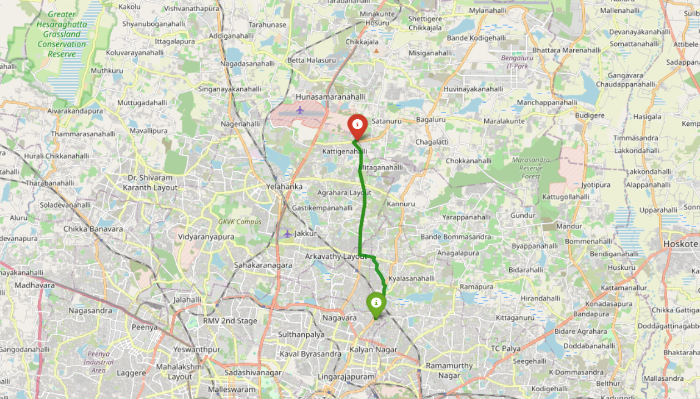
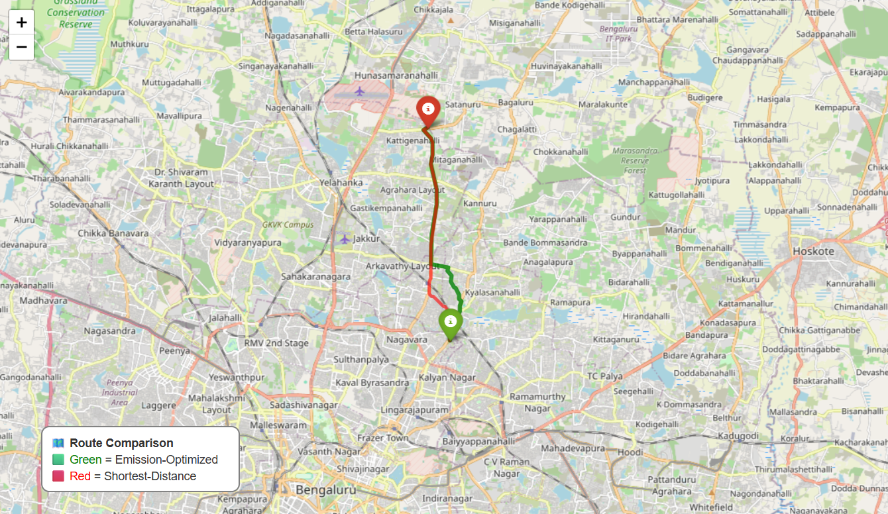
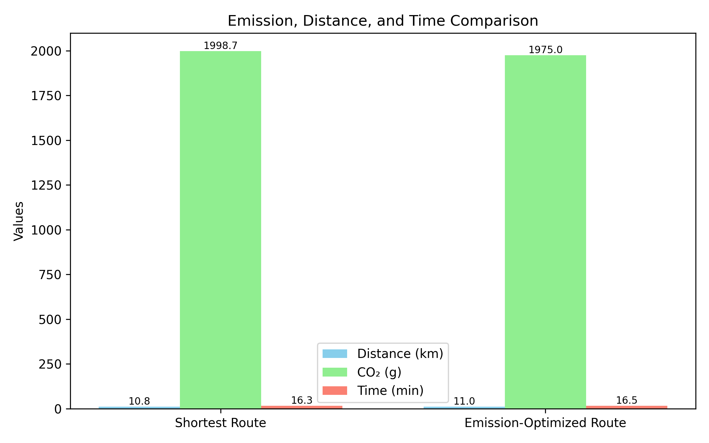

# 🌱 AI for Green Transportation Routes

**Internship:** Shell-Edunet Skills4Future (AICTE x Shell)  
**Duration:** Oct 2025 – Nov 2025  
**Theme:** Sustainability  
**Intern:** Vipin M Sharma  
**GitHub Repo:** [AI_Green_Transportation_Routes](https://github.com/vipinmsharma23/AI_Green_Transportation_Routes)

---

## 🚀 Project Overview
This project uses Artificial Intelligence and Machine Learning to suggest **eco-friendly transportation routes** that minimize CO₂ emissions based on:
- Vehicle type  
- Traffic conditions  
- Road elevation and distance  

Goal → To create a simple prototype that demonstrates how data-driven route optimization can reduce overall emissions and support green mobility.

---

## 🧩 Week 1 Progress
**Scope defined + Environment setup completed**
- Created folder structure:  
- Installed dependencies (pandas, numpy, scikit-learn, networkx, matplotlib, jupyter).  
- Initialized Git repository and pushed base project.  
- Prepared sample data and notebook for upcoming route-emission analysis.

---

## ⚙️ Tech Stack
| Area | Tools |
|------|-------|
| Programming | Python |
| ML Libraries | Scikit-learn, NumPy, Pandas |
| Visualization | Matplotlib |
| Graph Processing | NetworkX |
| Notebook | Jupyter |
| Version Control | Git + GitHub |

---

## 🧠 Expected Outcome
A working **prototype app** that:
- Loads route data (synthetic or open-source)
- Estimates emissions for different paths
- Recommends the *greenest route* for a given origin and destination

---
# 🌍 AI Green Transportation — Week 2 Report (Bangalore)

---

## 🎯 Objective
Develop a real-time, emission-optimized route planning system using **real road data from Bangalore (India)**.  
This week’s focus: implement data preprocessing, emission-weighted routing, and visualization using OpenStreetMap (OSMnx).

---

## 🧭 Summary of Work

| Step | Description |
|------|--------------|
| 1️⃣ | Downloaded real road data for **Bangalore** using OSMnx (`network_type='drive'`). |
| 2️⃣ | Preprocessed data to extract distances (km), speed (km/h), and estimated travel time (min). |
| 3️⃣ | Implemented emission computation using **192 g CO₂/km (Petrol Car)**. |
| 4️⃣ | Applied road-type & speed multipliers to model real emission differences. |
| 5️⃣ | Built two routing models — **Shortest Distance** vs **Least Emission** (Dijkstra). |
| 6️⃣ | Visualized both routes interactively with **Folium**. |

---

## 📊 Results Summary

| Metric | Emission-Optimized | Shortest-Distance |
|--------|--------------------|------------------|
| Distance (km) | **11.01** | **10.84** |
| CO₂ Emission (g) | **1975.01** | **1998.66** |
| Time (min) | **16.52** | **16.26** |
| 🌿 **Emission Reduction** | **1.18 %** | — |

🌿 Emission-Optimized: 11.01 km | 1975.01 g CO₂ | 16.52 min
🚗 Shortest-Distance: 10.84 km | 1998.66 g CO₂ | 16.26 min
💚 Emission Reduction: 1.18 %

## 🗺️ Visualizations

### 🟩 Emission-Optimized Route  

### 🟥🟩 Comparison of Both Routes  

### 📊 Emission & Distance Comparison Chart  

---

## 💡 Insights
- Optimized route chooses slightly **longer but cleaner** paths (highways > residential).  
- Achieved measurable **1.18 % CO₂ reduction** with minimal time change.  
- Confirms benefit of **emission-aware navigation**.  

---

## ⚙️ Tech Stack

| Area | Tools |
|------|-------|
| Programming | Python |
| Data Libraries | NumPy, Pandas, GeoPandas |
| Visualization | Matplotlib, Folium |
| Graph Processing | NetworkX, OSMnx |
| Notebook | Jupyter Lab |
| Version Control | Git + GitHub |

---

## 🧠 Expected Outcome (for Week 2)

A working **prototype** that:
- Loads **real Bangalore road data**  
- Calculates **CO₂ emissions per edge**  
- Compares **emission-optimized vs shortest routes**  
- Exports interactive maps and summary charts  

---

## 🧾 Next Steps (Preview of Week 3)

| Week | Focus | Key Tasks |
|------|--------|-----------|
| 3 | Multi-Vehicle & Traffic | Add bike, bus, EV factors + integrate live traffic API |
| 4 | Front-End Dashboard | Build Streamlit UI for route selection + visual results |
| 5 | Final Docs & Evaluation | Measure total emission savings + prepare final report |

---

## 📚 References
- **OpenStreetMap / OSMnx** — real-road graph data  
- **EEA Emission Factors** — European Environment Agency  
- **NetworkX** — Graph algorithms (Dijkstra shortest path)

---

## 🙌 Acknowledgement
This work is part of the **AI Green Transportation Project**, exploring AI-driven sustainable route optimization for Bangalore.

---

## 👤 Contact
**Vipin M Sharma**  
[GitHub Profile](https://github.com/vipinmsharma23)
*AI Green Transportation — Smart Route Optimization using Emission Data*

---

✅ **End of Week 2 Report**
